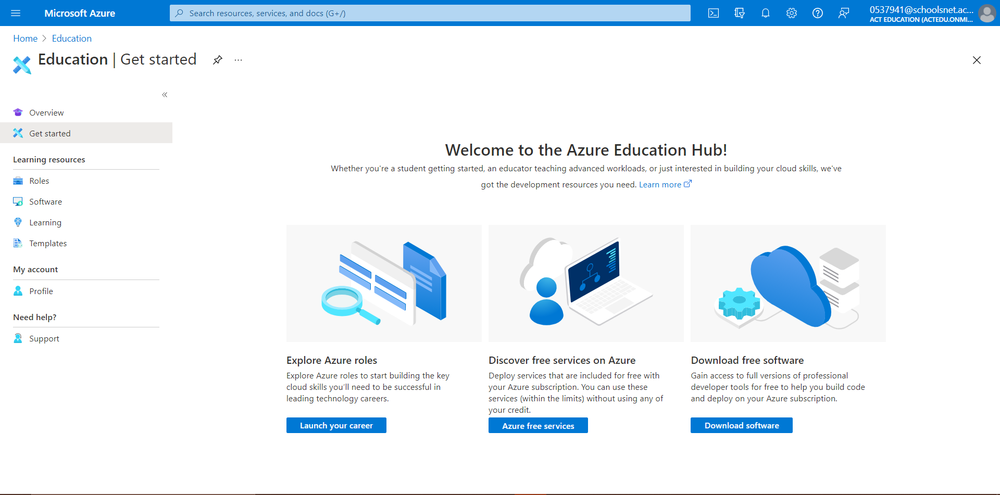
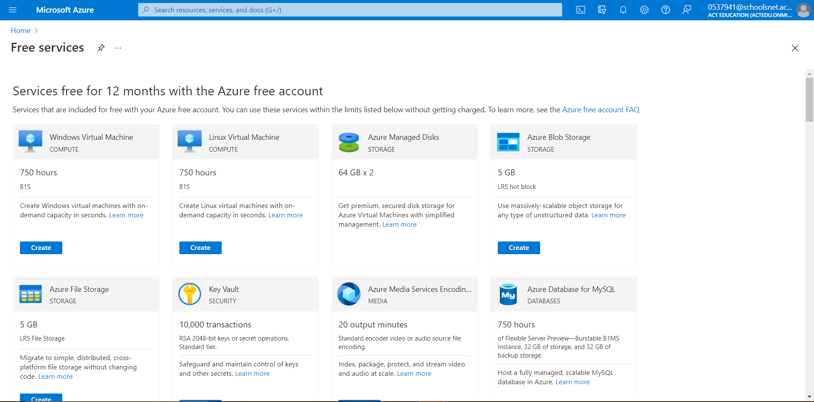
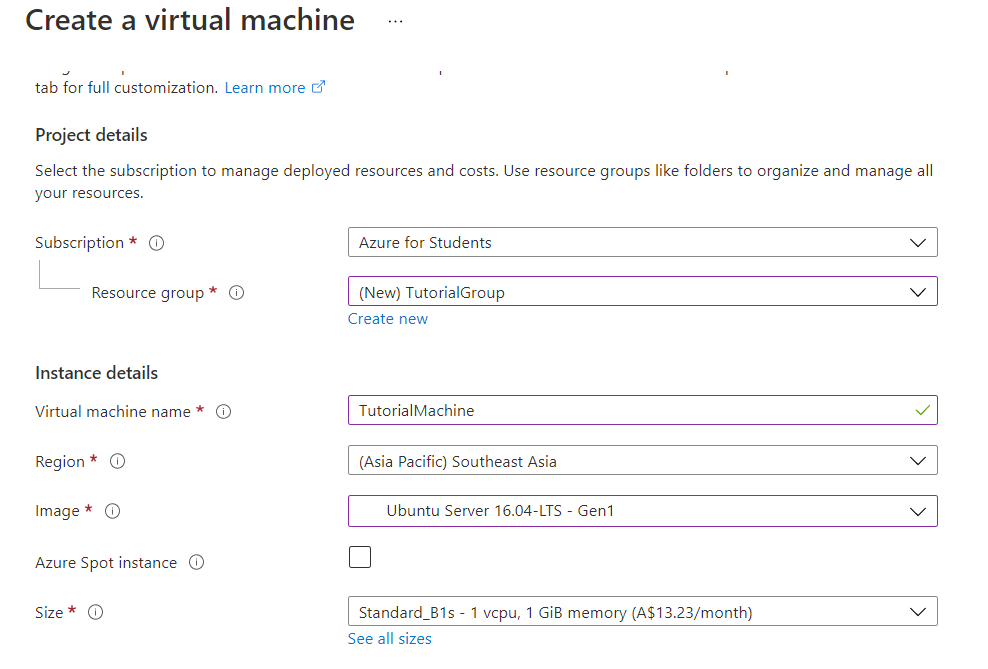
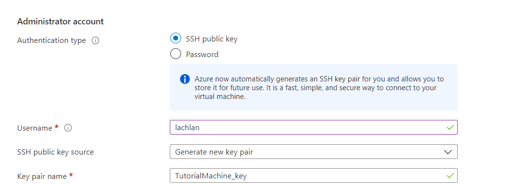
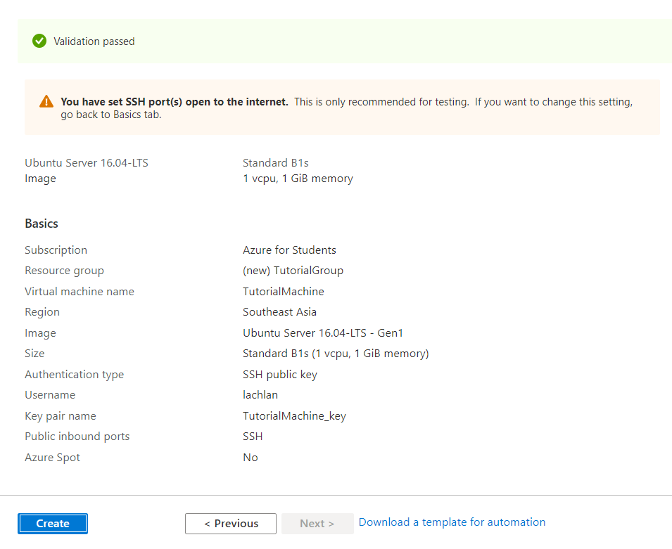
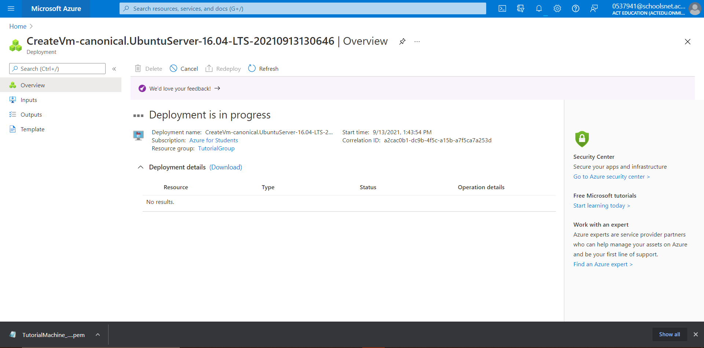

# Azure-Chrome-Remote-Desktop-Tutorial
A tutorial on how to setup remote desktop

### Overview
 - Create a Microsoft Azure student account
 - Create a Virtual Machine
 - Setup SSH
 - Setup Virtual Machine
 - Setup Bastion
 - Install Xubuntu and Xfce
 - Setup Chrome Remote Desktop
 - Start Chrome Remote Desktop and make it run on boot
 - Connect with Chrome Remote Desktop

## Step one - Create a Microsoft Azure student account
 - Go to [https://azure.microsoft.com/en-au/free/students/](https://azure.microsoft.com/en-au/free/students/) 
 - Click "Start for Free"
 - Fill in your details and get to this screen

## Step two - Create a Virtual Machine
 - Click "Azure free services"
 - Choose the "Linux Virtual Machine" from the list

 - Set the subscription to "Azure for Students"
 - Create a new Resource group (name doesn't matter)
 - Set the virtual machine name to what you want your machine to be called
 - Set the Region to Southeast Asia
 - Set the image to "Ubuntu Server 16.04-LTS - Gen1"
 - Don't change the Size and don't turn on Azure spot instance

## Step Three - Setup SSH
 - Now in order to securely login to the remote shell you need to create a private key
 - Change the username to whatever you want (MUST BE LOWERCASE!)(I just used my first name)

## Step Four - Setup Virtual Machine
 - Ignore the Inbound Port Rules and click Review + create
 - After reviewing the configuration and making sure it all looks good, click Create, take a ~5min break and come back when it is setup!
 - When prompted, click Download private key and create resource and then click Return to create a virtual machine

# DO NOT LOSE THE PRIVATE KEY!!!!!!!!! (IMPORTANT)

