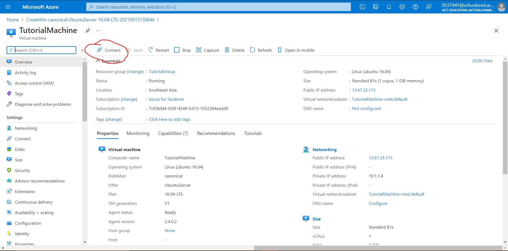
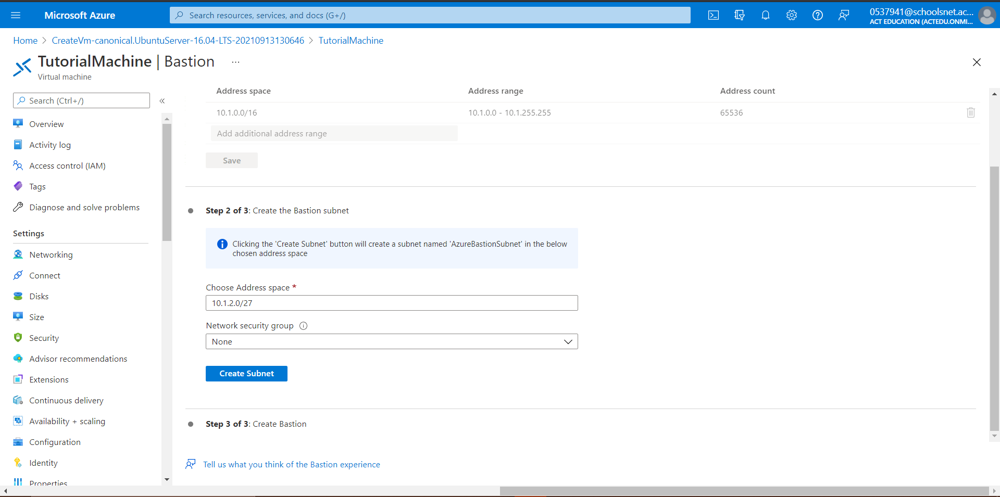
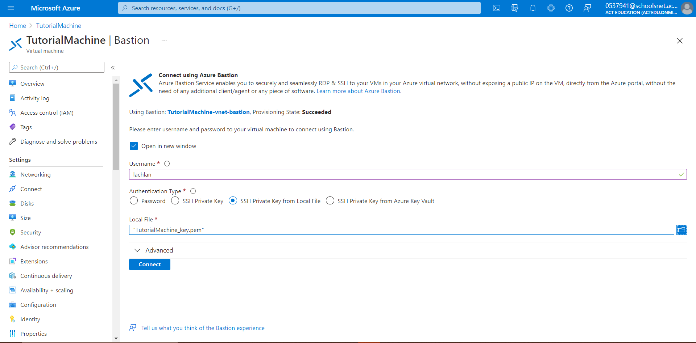
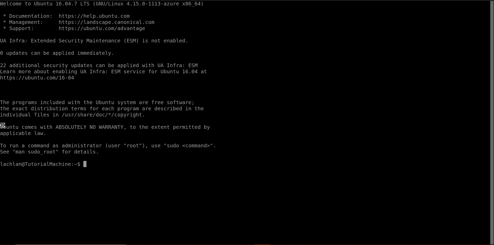
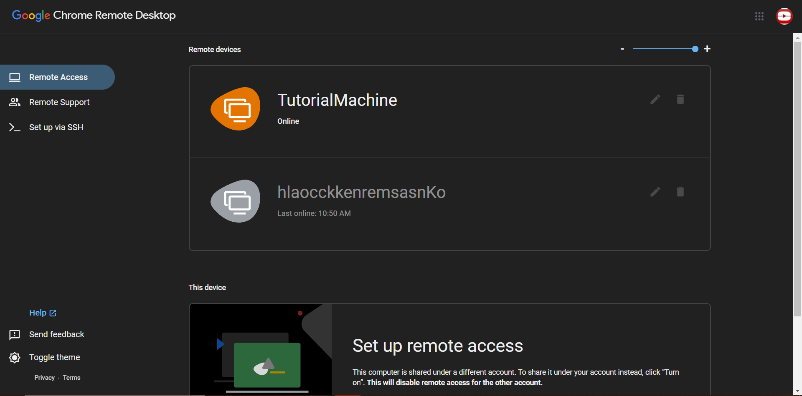
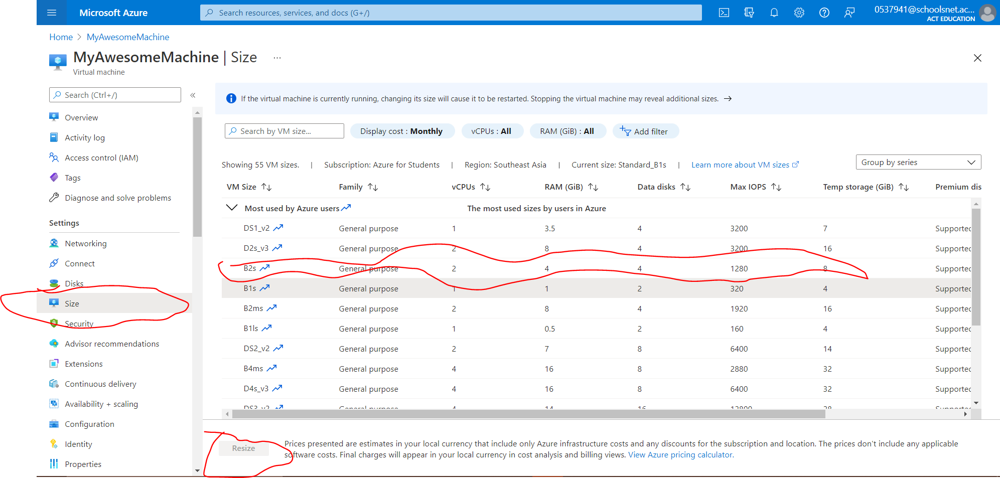

# Azure-Chrome-Remote-Desktop-Tutorial
A tutorial on how to setup remote desktop

### Overview
 - Create a Microsoft Azure student account
 - Create a Virtual Machine
 - Setup SSH
 - Setup Virtual Machine
 - Setup Bastion
 - Install Xubuntu and Xfce
 - Setup Chrome Remote Desktop
 - Start Chrome Remote Desktop and make it run on boot
 - Connect with Chrome Remote Desktop

## Step one - Create a Microsoft Azure student account
 - Go to [https://azure.microsoft.com/en-au/free/students/](https://azure.microsoft.com/en-au/free/students/) 
 - Click "Start for Free"
 - Fill in your details and get to this screen


## Step two - Create a Virtual Machine
 - Click "Azure free services"
 - Choose the "Linux Virtual Machine" from the list


 - Set the subscription to "Azure for Students"
 - Create a new Resource group (name doesn't matter)
 - Set the virtual machine name to what you want your machine to be called
 - Set the Region to Southeast Asia
 - Set the image to "Ubuntu Server 16.04-LTS - Gen1"
 - Don't change the Size and don't turn on Azure spot instance


## Step Three - Setup SSH
 - Now in order to securely login to the remote shell you need to create a private key
 - Change the username to whatever you want (MUST BE LOWERCASE!)(I just used my first name)


## Step Four - Setup Virtual Machine
 - Ignore the Inbound Port Rules and click Review + create
 - After reviewing the configuration and making sure it all looks good, click Create, take a ~5min break and come back when it is setup!
 - When prompted, click Download private key and create resource and then click Return to create a virtual machine

# DO NOT LOSE THE PRIVATE KEY!!!!!!!!! (IMPORTANT)


## Step Five - Setup Bastion
 - Now that we have setup the machine, we are going to setup Bastion so we can access the machine's command line remotely
 - Click the connect button and select the Bastion option from the dropdown



 - Once you are on the Bastion connection page, click the "Use Bastion" button
 - It will take you to a page that looks like this:



 - Leave the Address space as it is
 - Do not choose a network security group and click "Create Subnet"
 - Leave all the other settings as their default and then click "Create Azure Bastion using defaults"
 - This will take ~10 mins, so take a break and come back then

## Step Six - Install Xubuntu and Xfce
 - Now that the Bastion is setup, you go back to you virtual machine and click "Connect" and then select "Bastion"
 - Select the "SSH private key from file" option
 - Set the username to the username you set before and upload the private key that you downloaded earlier



 - A new window should pop up and you should see a command prompt!



 - Now you need to install the things needed to run chrome remote desktop
 - On ubuntu server, a desktop environment is not installed by default so we need to install it
 - Before we install anything, we need to update the places where ubuntu gets the packages from
```bash
sudo apt install update && sudo apt install full-upgrade
```
 - Now type
```bash
sudo apt install xubuntu-desktop
```

## Step Seven - Setup Chrome Remote Desktop
 - Navigate to the [chrome remote desktop headless setup](https://remotedesktop.google.com/headless) page
 - Click begin
 - Right click and copy the [Debian Linux link](https://dl.google.com/linux/direct/chrome-remote-desktop_current_amd64.deb)
 - Type 
```bash
wget https://dl.google.com/linux/direct/chrome-remote-desktop_current_amd64.deb
```
 - Now after it gets the package, we need to install it
 - Type
```bash
sudo dpkg -i ./chrome-remote-desktop_current_amd64.deb
```
 - The first time you run this, it will encounter an error
 - After it gives you the error, type
```bash
sudo apt update && sudo apt full-upgrade
```
 - After that run
```bash
sudo apt-get -f install
```
 - Now go back to the chrome remote desktop site and click next and Authorize
 - Now copy the command for debian linux and paste it into the virtual machine
 - After you have entered the password type 
```bash
sudo systemctl status chrome-remote-desktop@username
```
 - e.g.
```bash
sudo systemctl status chrome-remote-desktop@lachlan
```
 - Now we want it to start when your virtual machine turns on
 - Type
```bash
sudo systemctl enable chrome-remote-desktop@username
```
 - Now we need to install `xubuntu-desktop` again (for some unknown reason lol)
 - So type
```bash
sudo apt install xubuntu-desktop
```
 - This will take a while so take another break and come back later

## Step Eight - Connect with Chrome Remote Desktop
 - Now go back to chrome remote desktop click "Remote Access"
 - You should now see your machine which you can login to with the pin you created before!



 - Once you are in you will see 2 options, Xsession and Xfce, choose the Xfce option.
 - For a better experience you may want to size up your machine:

